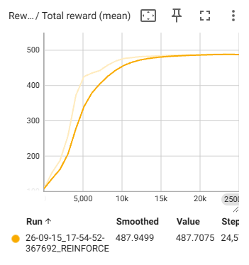
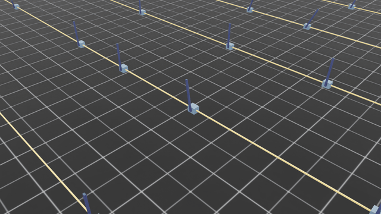
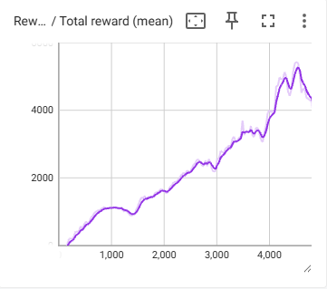
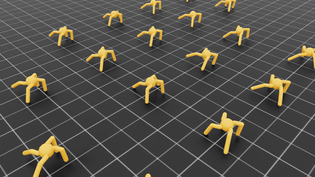

# Robot learning algorithms in one file

Straightforward implementations of popular robotics control training algorithms. Each algorithm is written in pytorch, trained using isaacsim, and written in a single file so you can see exactly what's going on.

So far it covers two popular reinforcement learning approaches: **Reinforce** (reinforce), and **Advantage Actor-Critic** (A2C).

If you are trying to learn RL I reccomend starting with Reinforce. Once you understand that, the jump to A2C is quite straightforward.


## Requirements
`python3`
`pytorch`
`IsaacLab`
`TensorBoard`

All of the usage and examples below assume you are running the commands inside the python venv that you set up during IsaacLab installation.

## Benchmarks

### Reinforce

Reinforce is the classic RL algorithm, where we train an actor model based on rewards provided from the environment.
We run rollouts (robot attempts at the task) to collect experiences (sets of state, action and reward). We calculate the loss based on the discounted future reward for the episode, then backpropagate to update the actor network weights to increase the likelyhood of high reward actions. The huggingface reinforcement learning course gives a good intro to the maths that grounds the algorithm.

I chose to demonstrate the Reinforce algorithm on Cartpole, a classic RL task which is simple enough for it to solve.




### A2C

Advantage Actor Critic extends the Reinforce approach by introducing a second neural network, the Critic. Relatively few lines of code are changed, but the critic solves the major problem with reinforce - good early actions can be unfairly downweighted due to bad later actions.

The critic outputs a value estimation for each state, which is then used to calculate the Advantage, i.e. how much better the chosen action was than what we would expect to acheive given the starting state. 

I chose to demonstrate the Advantage Actor Critic algorithm on the Ant task. This is significantly more complex than Cartpole, so it stretches the capability of A2C. You can see from the GIF that the policy does not reach fullly desirable behaviour. It learns to move just one leg to push itself along.





## Usage

```
usage: reinforce.py/a2c.py [-h] [--checkpoint CHECKPOINT] [--eval] [--num_envs NUM_ENVS] [--task TASK] [--seed SEED] [--disable_fabric] [--distributed] [--headless] [--livestream {0,1,2}]
                    [--enable_cameras] [--xr] [--device DEVICE] [--verbose] [--info] [--experience EXPERIENCE] [--rendering_mode {balanced,performance,quality}] [--kit_args KIT_ARGS]
                    [--anim_recording_enabled] [--anim_recording_start_time ANIM_RECORDING_START_TIME] [--anim_recording_stop_time ANIM_RECORDING_STOP_TIME]

options:
  -h, --help            show this help message and exit
  --checkpoint CHECKPOINT
                        Load checkpoint from path
  --eval                Run in evaluation mode (no dropout or batchnorm)
  --num_envs NUM_ENVS   Number of environments to simulate
  --task TASK           Name of the task
  --seed SEED           Seed used for the environment
  --disable_fabric      Disable fabric and use USD I/O operations
  --distributed         Run training with multiple GPUs or nodes

app_launcher arguments:
  Arguments for the AppLauncher. For more details, please check the documentation.

  --headless            Force display off at all times.
  --livestream {0,1,2}  Force enable livestreaming. Mapping corresponds to that for the `LIVESTREAM` environment variable.
  --enable_cameras      Enable camera sensors and relevant extension dependencies.
  --xr                  Enable XR mode for VR/AR applications.
  --device DEVICE       The device to run the simulation on. Can be "cpu", "cuda", "cuda:N", where N is the device ID
  --verbose             Enable verbose-level log output from the SimulationApp.
  --info                Enable info-level log output from the SimulationApp.
  --experience EXPERIENCE
                        The experience file to load when launching the SimulationApp. If an empty string is provided, the experience file is determined based on the headless flag. If
                        a relative path is provided, it is resolved relative to the `apps` folder in Isaac Sim and Isaac Lab (in that order).
  --rendering_mode {balanced,performance,quality}
                        Sets the rendering mode. Preset settings files can be found in apps/rendering_modes. Can be "performance", "balanced", or "quality". Individual settings can
                        be overwritten by using the RenderCfg class.
  --kit_args KIT_ARGS   Command line arguments for Omniverse Kit as a string separated by a space delimiter. Example usage: --kit_args "--ext-folder=/path/to/ext1 --ext-
                        folder=/path/to/ext2"
  --anim_recording_enabled
                        Enable recording time-sampled USD animations from IsaacLab PhysX simulations.
  --anim_recording_start_time ANIM_RECORDING_START_TIME
                        Set time that animation recording begins playing. If not set, the recording will start from the beginning.
  --anim_recording_stop_time ANIM_RECORDING_STOP_TIME
                        Set time that animation recording stops playing. If the process is shutdown before the stop time is exceeded, then the animation is not recorded.
```

## Examples

Run the Reinforce script in headless mode for training:
```python .\reinforcement-learning\reinforce.py --headless```

Evaluate the trained Reinforce script:
```python .\reinforcement-learning\reinforce.py --checkpoint ./reinforcement-learning/reinforce_cartpole.pth --eval```